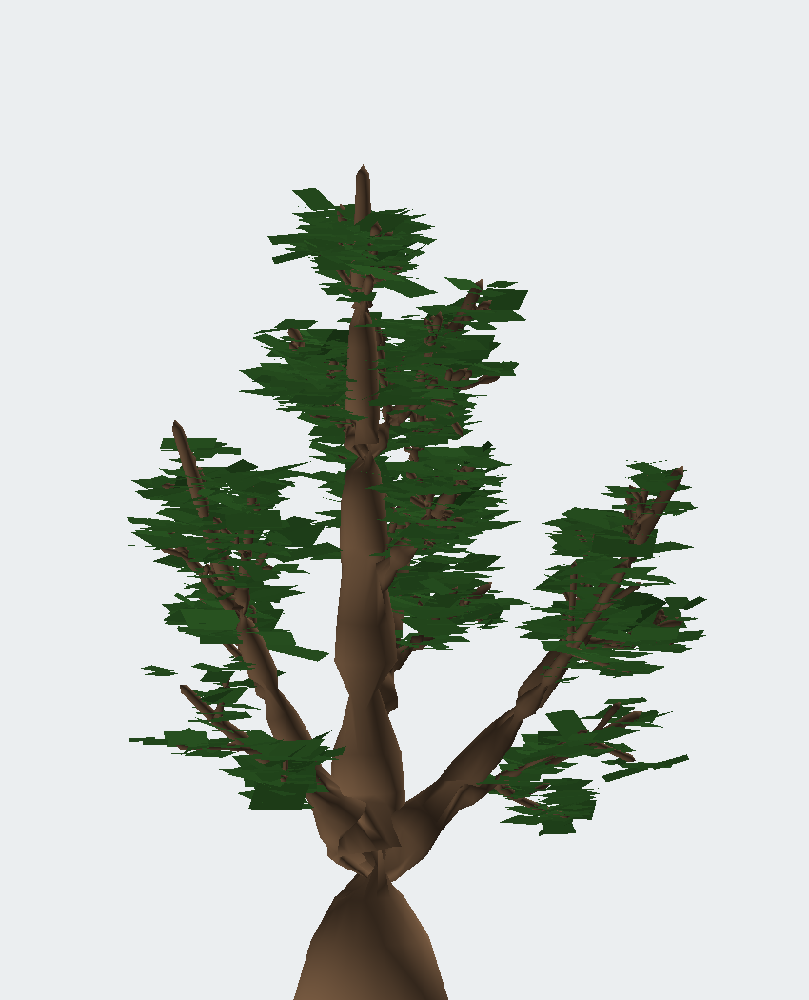
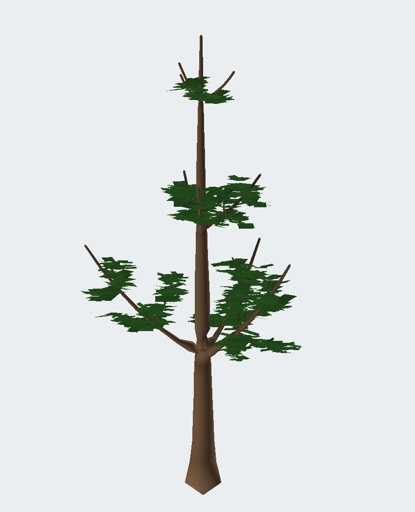
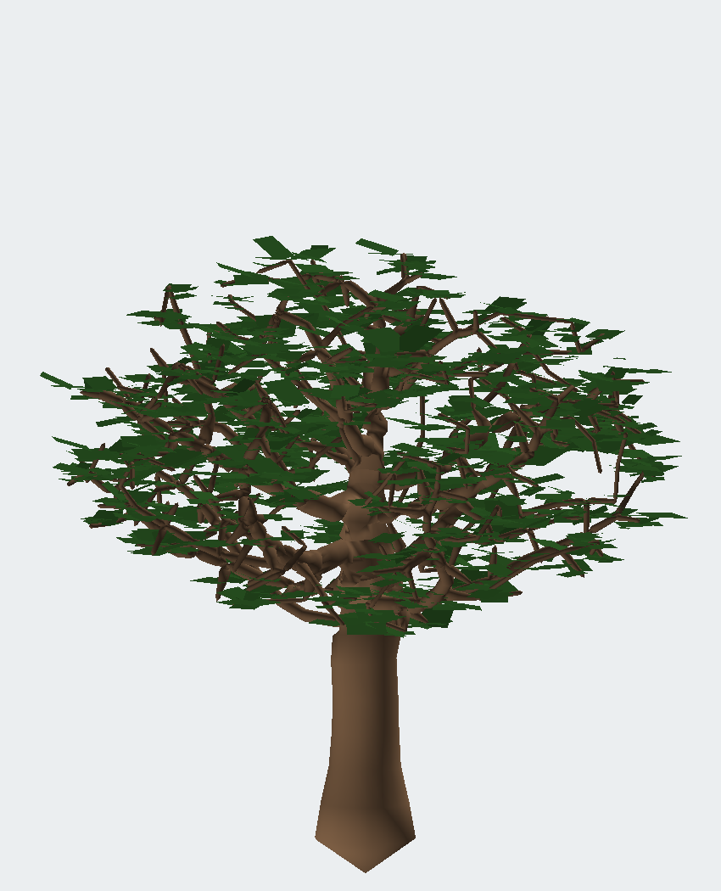
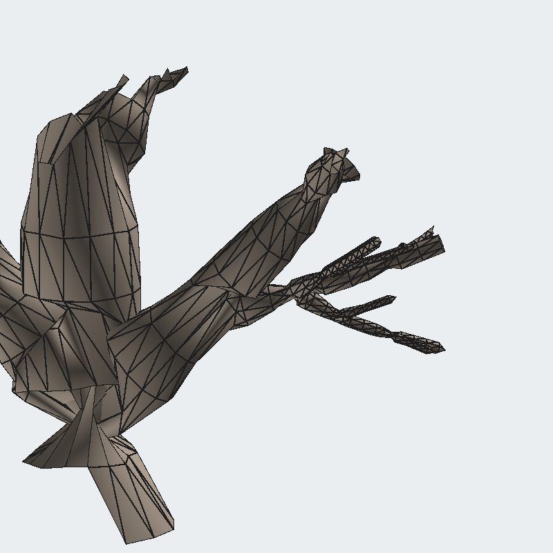

# Frontier — Single-Mesh Procedural Trees

A procedural tree generator whose bark is **one closed, manifold mesh**
with **fused branch junctions** (L-style welded collars — never
I-style intersecting tubes), built to bend under wind without cracking.
Unreal/Blender-class output: hero LODs, leaf cards, pivot-wind payload,
glTF/OBJ export, Blender addon, UE5 wind material.





Fused junction topology (single skin, shared crotch vertex, quad flow):



## Guarantees (tested, not promised)

Every generated bark mesh passes `validate_mesh`:

* **closed** — 0 boundary edges · **manifold** — 0 non-manifold edges
* **single component** · **genus 0** (`V − E + F == 2`) · outward winding
* construction is outward by design (a signed-volume guard never fires)

```
tests: 5/5 OK — 5 species × seeds × LODs, all watertight
```

## Quickstart

```bash
pip install numpy pillow matplotlib        # only dependencies
python tools/frontier_cli.py generate --preset oak --seed 1 --out out/oak_01
# → out/oak_01/oak_01_lod0.glb (+ .obj, .viewer.json, summary.json)
python tools/frontier_cli.py batch --preset birch --seeds 1-8 --out out/birch_set
python -m unittest tests.test_all
```

Interactive wind proof (zero-dependency WebGL, pivot shader + wireframe):

```bash
python tools/frontier_cli.py generate --preset oak --seed 1 --format viewer --out /tmp/fv
cp /tmp/fv/oak_01_lod0.viewer.json viewer/tree.json
python -m http.server --directory viewer 8123   # open localhost:8123
```

## How it works

1. **Skeleton** — recursive leader+laterals grower (4 species) or space
   colonization; N-furcations rewritten to binary chains; twist-free
   parallel-transport frames.
2. **Fused meshing** — tapered tube rings lofted with quads; every Y
   junction becomes a *pair-of-pants* web (front/back quad disks sharing
   one crotch vertex + collar swelling), so parent→branch is one
   continuous skin sharing vertices. Count transitions use manifold
   "dart" bridges. See [docs/ALGORITHM.md](docs/ALGORITHM.md).
3. **Wind payload** — per vertex: `weight` (0 trunk → 1 tips), branch
   `phase`, `pivot` (branch base), `flutter`, AO. Packed as
   `COLOR_0=(weight,phase,ao,level)`, `TEXCOORD_1=pivot.xy`,
   `TEXCOORD_2=(pivot.z,flutter)` — true pivot rotation, no textures.
4. **Leaves** — one merged quad-card mesh with the same wind packing.

## Repo layout

| Path                  | What                                              |
|-----------------------|---------------------------------------------------|
| `frontier/`           | core: skeleton, meshing, attributes, exports      |
| `tools/frontier_cli`  | generate / batch / LODs CLI                       |
| `tests/`              | topology + payload + export test suite            |
| `viewer/`             | dependency-free WebGL wind preview                |
| `blender_addon/`      | Blender 4.x addon (+ `make_blender_zip.py`)       |
| `unreal/`             | UE5 pivot-wind HLSL ([setup](docs/UNREAL.md))     |
| `docs/`               | algorithm, engine guides, species                 |
| `examples/`           | software-renderer previews                        |
| `assets/`             | procedural placeholder bark/leaf textures         |

Docs: [Algorithm](docs/ALGORITHM.md) · [Unreal](docs/UNREAL.md) ·
[Blender](docs/BLENDER.md) · [Species](docs/SPECIES.md)
