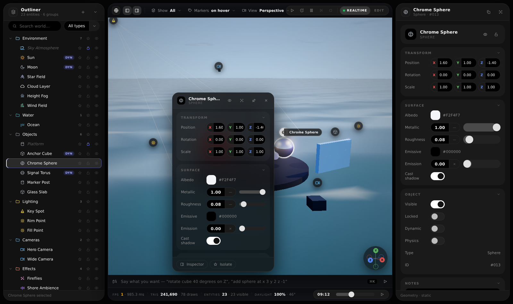
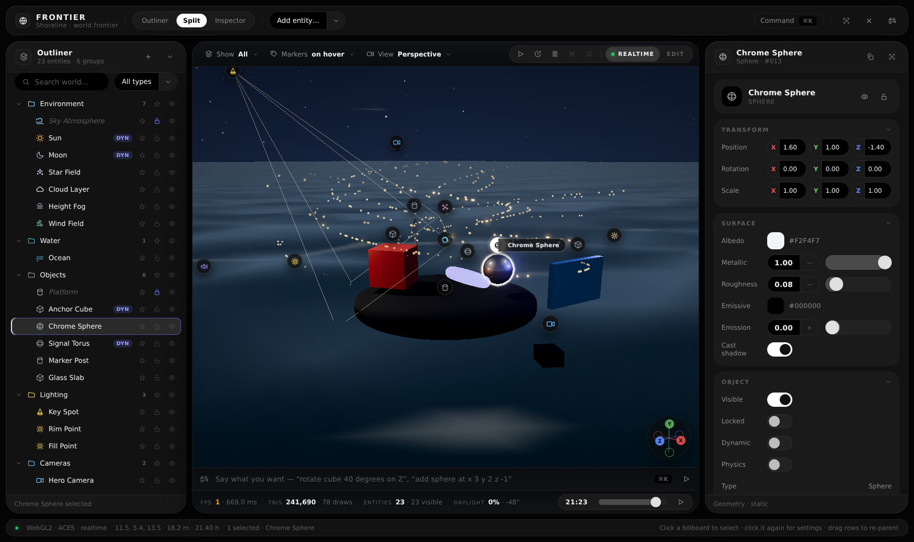
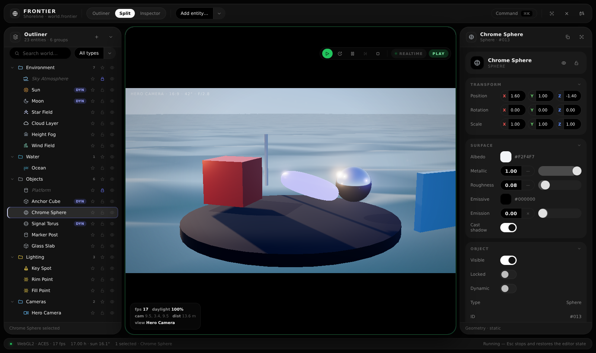
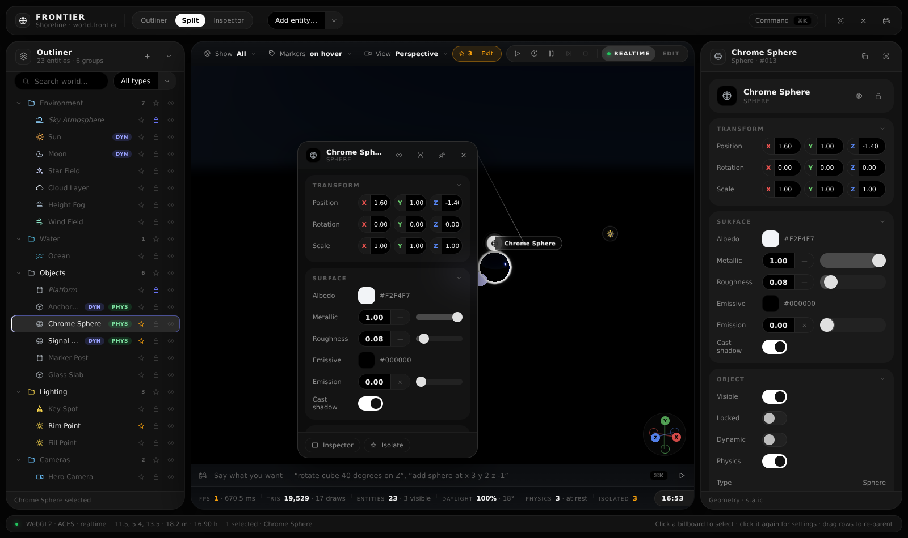
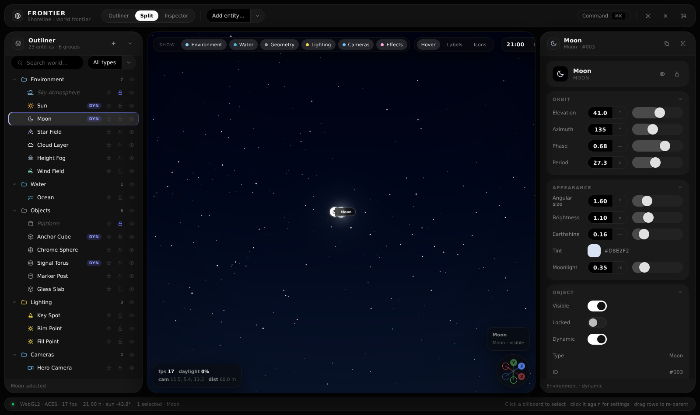

# Frontier — World Editor UI

A state-of-the-art outliner for a real-time world editor, built in the **Slate UI language**
(tokens lifted verbatim from `Slate/References/UIComponents.html`) and extended in three directions:

1. **More of the world.** Not just meshes — sky, sun, moon, stars, clouds, fog, wind, water,
   lights, cameras, particles, reflection probes, audio emitters and the post stack are all first
   class entities in one tree.
2. **A viewport you can point at.** Every entity is drawn in 3D as a **billboard marker**. Click a
   billboard to select it, click it again (or press <kbd>Enter</kbd>) and its **settings popup**
   opens right where the object lives, tethered to the marker and made of exactly the same
   controls as the docked inspector.
3. **A viewport with a transport.** Unreal's model: **Play** runs the world through a scene camera
   behind a framing gate, **Simulate** runs it with the editor camera still free, **Pause** and
   **Step** own the clock, **Stop** puts the world back exactly as you left it. When nothing is
   running you can drop the viewport out of realtime altogether and it redraws only on change.



```bash
npm install
npm run dev          # http://localhost:5173
npm run build        # dist/ — relative asset paths, deployable to any subpath
npm run build:pages  # docs/ — the same build, committed for GitHub Pages
```

**Live:** <https://c7egoist.github.io/Frontier/>

---

## Deploying

**This repository cannot be served raw.** `index.html` is a Vite entry point: it points at
`/src/main.js` and the modules import `three` as a bare specifier. Publishing the branch as-is
gives you unstyled HTML and a 404 for the script — the browser is asking for
`c7egoist.github.io/src/main.js`, which does not exist. It has to be built first.

The built site is committed to `docs/`, so Pages can serve it with no CI:

> **Settings → Pages → Source: Deploy from a branch → Branch `arena/01a08158-frontier`,
> folder `/docs` → Save.** Wait a minute, then hard-reload
> <https://c7egoist.github.io/Frontier/>.

After changing any source file run `npm run build:pages` and commit `docs/` again. `base` is
`'./'` in `vite.config.js`, so the same output works at the domain root, under `/Frontier/`, or
straight off the filesystem.

<details>
<summary>Prefer CI over a committed build? Add this workflow yourself</summary>

Create `.github/workflows/pages.yml` — it has to be added from the GitHub web UI or your own
machine, because app tokens are not permitted to push workflow files — then set
**Settings → Pages → Source: GitHub Actions**.

```yaml
name: Deploy to GitHub Pages
on:
  push:
    branches: [arena/01a08158-frontier, main]
  workflow_dispatch:
permissions: { contents: read, pages: write, id-token: write }
concurrency: { group: pages, cancel-in-progress: true }
jobs:
  build:
    runs-on: ubuntu-latest
    steps:
      - uses: actions/checkout@v4
      - uses: actions/setup-node@v4
        with: { node-version: 20, cache: npm }
      - run: npm ci
      - run: npm run build
      - uses: actions/configure-pages@v5
      - uses: actions/upload-pages-artifact@v3
        with: { path: dist }
  deploy:
    needs: build
    runs-on: ubuntu-latest
    environment: { name: github-pages, url: '${{ steps.deployment.outputs.page_url }}' }
    steps:
      - id: deployment
        uses: actions/deploy-pages@v4
```

If that job fails with *"not allowed to deploy to github-pages due to environment protection
rules"*, add this branch under **Settings → Environments → github-pages → Deployment branches**.
</details>

---

## The interaction model

| I want to…                              | I do…                                                                    |
| --------------------------------------- | ------------------------------------------------------------------------ |
| find something in a busy world           | search / type-filter chips in the outliner, or <kbd>⌘K</kbd> command palette |
| select an object I can see               | click its billboard (or click the geometry itself)                        |
| tune it without losing the view          | click the billboard again → floating settings popup, tethered to the marker |
| compare two entities                     | open several popups at once, pin the ones that should stay put            |
| tune it with room to breathe             | the docked inspector on the right, same sheet, more width                 |
| stop the scene being a wall of pills     | markers declutter by depth; labels are hover / always / off                |
| reorganise the world                     | drag tree rows to re-parent — drop *inside* a folder or *between* rows     |
| light the shot                           | scrub the time-of-day pill under the viewport, or run the day cycle        |
| see the shot the way the camera sees it | **Play** — the gate masks in, the editor furniture steps out of frame      |
| watch the world move but keep flying    | **Simulate** — same clock, your camera                                     |
| study one thing in a busy world         | select any number of entities and **Isolate** them (<kbd>I</kbd>)          |
| get back to a known view                | the axis orb: click a knob to snap, drag to orbit, double-click to frame all |

Popups and the dock are **the same property sheet**, generated from the same schema, bound to the
same model — change a slider in one and the other moves on the same frame.



---

## Transport

| Control | What it does |
| --- | --- |
| **Play** <kbd>Alt P</kbd> | Looks through the selected camera (or the first one), masks the frame to its gate, hides billboards, gizmos, selection outlines and viewport furniture, and tags the frame with lens and aperture. |
| **Simulate** <kbd>Alt S</kbd> | Runs the same clock with the editor camera unlocked, so you can fly around a world that is moving. |
| **Pause** <kbd>P</kbd> | Freezes the clock. Everything stays interactive; nothing advances. |
| **Step** <kbd>.</kbd> | Advances exactly one frame (1/30 s) while paused. |
| **Stop** <kbd>Esc</kbd> | Ends the run and **restores the snapshot** taken when it started — every property, name, visibility and lock, the time of day, and anything spawned mid-run is discarded. |
| **Realtime** <kbd>Ctrl R</kbd> | Editor-only toggle. Off, the viewport animates nothing and redraws only when something changes — the same idea as Unreal's realtime viewport switch. It is forced on during a run. |

The state chip on the right of the pill always names the truth: `Edit`, `Edit · static`,
`Simulate`, `Play`, `Paused`.



---

## Isolation

Isolation is a **set**, not a solo slot. Select any number of entities and press <kbd>I</kbd>, or
click the star on any row, or use the popup's *Isolate* button — each one adds to or leaves the
set. Isolating a folder keeps its whole subtree. Everything outside the set stops rendering and its
billboard goes with it, the rows dim in the tree, and an amber banner over the viewport counts what
is isolated and offers the way out (<kbd>Esc</kbd> also exits).



---

## Entities

| Group           | Entities                                                                        |
| --------------- | ------------------------------------------------------------------------------- |
| **Environment** | Sky Atmosphere · Sun · Moon · Star Field · Cloud Layer · Height Fog · Wind Field |
| **Water**       | Ocean (Gerstner surface, sun glint, foam, fog integration)                       |
| **Geometry**    | Cube · Sphere · Torus · Cylinder · Plane                                          |
| **Lighting**    | Point Light · Spot Light                                                          |
| **Cameras**     | Camera proxies with lens, framing gate and frustum gizmo                          |
| **Effects**     | Particles · Reflection Probe · Audio Emitter · Post Stack                         |

Every one of them is *live*: the sun's elevation moves the shadows and repaints the sky, the moon's
phase is analytic, star brightness follows dusk, wind drives both the cloud deck and the swell,
the fog node owns `scene.fog`, and the post stack owns tone mapping, bloom, vignette and grain.
Metals reflect the real sky through a PMREM cube that is regenerated whenever the environment
changes (debounced, never per frame).



---

## Keyboard

| Key | Action | | Key | Action |
| --- | --- | --- | --- | --- |
| <kbd>⌘K</kbd> | command palette | | <kbd>F</kbd> | frame selection |
| <kbd>Enter</kbd> | toggle settings popup | | <kbd>Shift F</kbd> | frame the world |
| <kbd>H</kbd> | hide / show | | <kbd>L</kbd> | lock |
| <kbd>I</kbd> | isolate selection | | <kbd>⌘D</kbd> | duplicate |
| <kbd>↑ ↓</kbd> | walk the tree | | <kbd>← →</kbd> | collapse / expand |
| <kbd>⌫</kbd> | delete | | <kbd>Esc</kbd> | stop the run → exit isolation → close popups |
| <kbd>Alt P</kbd> | play | | <kbd>Alt S</kbd> | simulate |
| <kbd>P</kbd> | pause / resume | | <kbd>.</kbd> | step one frame |
| <kbd>Ctrl R</kbd> | realtime viewport | | | |

Double-click a row (or a popup title) to rename. Right-click anything for its context menu.

---

## Architecture

```
index.html          shell: topbar · outliner dock · stage · inspector dock · status bar
src/
  world.js          entity table + property SCHEMA + the authored scene (single source of truth)
  viewport.js       three.js scene: sky/moon shader, star dome, cloud deck, ocean, gizmos, post
  billboards.js     DOM markers projected from world-space anchors, depth sort + declutter
  outliner.js       tree: search, filters, twirl animation, multi-select, drag-to-reparent
  inspector.js      builds a property sheet for any node straight from its schema
  popup.js          floating, tethered, pinnable settings panels (same sheet, compact)
  kit.js            ControlKit primitives: slider, switch, value pill, axis field, dropdown, colour
  icons.js          one stroke language, 24×24
  bus.js            select / propchange / treechange
  styles.css        design tokens — the only place a colour or radius is written down
```

**Why the UI never hard-codes a control.** `world.js` describes each entity type as groups of
property definitions (`slider`, `switch`, `vec3`, `color`, `select`, `readout`). The inspector, the
popup, the command palette and the outliner filters all read that table, so adding an entity type —
or a property to an existing one — is a few lines of data, no UI work. That is also what makes the
sheet portable: the same table can drive the engine-side `ControlKit` panels one-for-one.

**Why DOM billboards instead of sprites.** Glyphs stay crisp at any distance, labels stay legible,
hit-testing is exact and free, hover/selected states are CSS, and a popup can be tethered to a
marker without a second projection path. The 3D scene keeps the pixels; the UI keeps the widgets.

### Tokens

`src/styles.css` is the Slate token block verbatim — surfaces `#050505 / #121212 / #1a1a1a / #000`,
strokes, `--hi: #6c77ff`, radii `24 / 18 / 999`, `--ease: cubic-bezier(.22,.61,.36,1)`. Sliders use
ControlKit geometry (the fill is a pill that ends under the thumb centre, never a hard-edged
gradient stop) and every numeric readout is type-in editable, clamped to its own range.

### Notes

* No terrain — deliberately. The world is sky, water, light and objects.
* `window.frontier` exposes `{ state, app, setTimeOfDay, vp, popups, outliner, billboards, world,
  setTransport, setPaused, setRealtime, stepFrame, snapView }` for console poking and automation.
* The viewport owns one clock. `vp.setClock({ animate, render })` is the only switch that decides
  whether the world moves and whether a frame is drawn; everything else — the transport, the day
  cycle, the realtime toggle — is a caller of it.
