# Frontier — World Editor UI

A state-of-the-art outliner for a real-time world editor, built in the **Slate UI language**
(tokens lifted verbatim from `Slate/References/UIComponents.html`) and extended in three directions:

1. **More of the world.** Not just meshes — sky, sun, moon, stars, clouds, fog, wind, water,
   lights, cameras, particles, reflection probes, audio emitters and the post stack are all first
   class entities in one tree.
2. **A viewport you can point at.** Every entity is drawn in 3D as a **billboard marker**. Click a
   billboard to select it, click it again (or press <kbd>Enter</kbd>) and its **settings popup**
   opens right where the object lives, tethered to the marker and made of exactly the same
   controls as the docked inspector.
3. **A viewport that is a panel, not a canvas with stickers.** It has a **header** — the two panel
   toggles, menus for what is shown, how markers read and where the camera is pointed, plus an
   Unreal-style transport strip — and a **footer** of live counters. There is no application bar
   above it and no status bar below it: the world fills the window, and the editor is the world
   plus exactly the panels you asked for.
4. **A console that speaks English.** A line under the viewport (<kbd>⌘K</kbd>) takes what you would
   say out loud — *"rotate anchor cube 40 degrees on z"*, *"add sphere at x 3 y 2 z -1"*,
   *"enable physics on selected objects"*, *"delete from ram marker post"* — completes it as you
   type, and shows you in a sentence what it is about to do before it does it.
5. **A transport.** Unreal's model: **Play** runs the world through a scene camera behind a framing
   gate, **Simulate** runs it with the editor camera still free, **Pause** and **Step** own the
   clock, **Stop** puts the world back exactly as you left it. When nothing is running you can drop
   the viewport out of realtime altogether and it redraws only on change.


```bash
npm install
npm run dev          # http://localhost:5173
npm run build        # dist/ — relative asset paths, deployable to any subpath
npm run build:pages  # docs/ — the same build, committed for GitHub Pages
```

**Live:** <https://c7egoist.github.io/Frontier/>

---

## Deploying

**This repository cannot be served raw.** `index.html` is a Vite entry point: it points at
`/src/main.js` and the modules import `three` as a bare specifier. Publishing the branch as-is
gives you unstyled HTML and a 404 for the script — the browser is asking for
`c7egoist.github.io/src/main.js`, which does not exist. It has to be built first.

The built site is committed to `docs/`, so Pages can serve it with no CI:

> **Settings → Pages → Source: Deploy from a branch → Branch `arena/01a08158-frontier`,
> folder `/docs` → Save.** Wait a minute, then hard-reload
> <https://c7egoist.github.io/Frontier/>.

After changing any source file run `npm run build:pages` and commit `docs/` again. `base` is
`'./'` in `vite.config.js`, so the same output works at the domain root, under `/Frontier/`, or
straight off the filesystem.

<details>
<summary>Prefer CI over a committed build? Add this workflow yourself</summary>

Create `.github/workflows/pages.yml` — it has to be added from the GitHub web UI or your own
machine, because app tokens are not permitted to push workflow files — then set
**Settings → Pages → Source: GitHub Actions**.

```yaml
name: Deploy to GitHub Pages
on:
  push:
    branches: [arena/01a08158-frontier, main]
  workflow_dispatch:
permissions: { contents: read, pages: write, id-token: write }
concurrency: { group: pages, cancel-in-progress: true }
jobs:
  build:
    runs-on: ubuntu-latest
    steps:
      - uses: actions/checkout@v4
      - uses: actions/setup-node@v4
        with: { node-version: 20, cache: npm }
      - run: npm ci
      - run: npm run build
      - uses: actions/configure-pages@v5
      - uses: actions/upload-pages-artifact@v3
        with: { path: dist }
  deploy:
    needs: build
    runs-on: ubuntu-latest
    environment: { name: github-pages, url: '${{ steps.deployment.outputs.page_url }}' }
    steps:
      - id: deployment
        uses: actions/deploy-pages@v4
```

If that job fails with *"not allowed to deploy to github-pages due to environment protection
rules"*, add this branch under **Settings → Environments → github-pages → Deployment branches**.
</details>

---

## The interaction model

| I want to…                              | I do…                                                                    |
| --------------------------------------- | ------------------------------------------------------------------------ |
| find something in a busy world           | search / type-filter chips in the outliner, or say `find chrome sphere`    |
| select an object I can see               | click its billboard (or click the geometry itself)                        |
| tune it without losing the view          | selecting **opens its settings popup** — tethered to the marker, dock or no dock |
| say what I want instead of hunting for it | the console: `move glass slab 2 m on x`, `set roughness of sphere to 0.2`  |
| compare two entities                     | open several popups at once, pin the ones that should stay put            |
| tune it with room to breathe             | the docked inspector on the right, same sheet, more width                 |
| stop the scene being a wall of pills     | markers declutter by depth; labels are hover / always / off                |
| reorganise the world                     | drag tree rows to re-parent — drop *inside* a folder or *between* rows     |
| light the shot                           | scrub the time-of-day pill in the viewport footer, or run the day cycle    |
| hide a whole class of thing              | **Show** menu in the header — categories with counts, All / None           |
| read the markers differently             | **Markers** menu — names on hover, names always, icons only                |
| get a straight-on view                   | **View** menu, or a knob on the gizmo: front, back, left, right, top, bottom |
| see the shot the way the camera sees it | **Play** — the gate masks in, the editor furniture steps out of frame      |
| watch the world move but keep flying    | **Simulate** — same clock, your camera                                     |
| study one thing in a busy world         | select any number of entities and **Isolate** them (<kbd>I</kbd>)          |
| get back to a known view                | the axis orb: click a knob to snap, drag to orbit, double-click to frame all |
| get the panels out of the way            | the two toggles at the left of the viewport header, or <kbd>[</kbd> / <kbd>]</kbd> |
| add something                            | the **+** in the outliner header, or `add sphere at x 3 y 2 z -1`          |
| make something fall                      | `enable physics on cube` then **Simulate** — it drops, bounces and sleeps   |
| free an entity for good                  | `delete from ram <name>` — the buffers go back to the driver, not to limbo  |

Popups and the dock are **the same property sheet**, generated from the same schema, bound to the
same model — change a slider in one and the other moves on the same frame.


---

## The console — plain English, no syntax

<kbd>⌘K</kbd> puts the caret in the line under the viewport. Type the way you would talk. It ghosts
the rest of the phrase behind your caret (<kbd>Tab</kbd> accepts), and the top row of the stack is
always **what this will do**, in a sentence, before you press <kbd>Enter</kbd>.

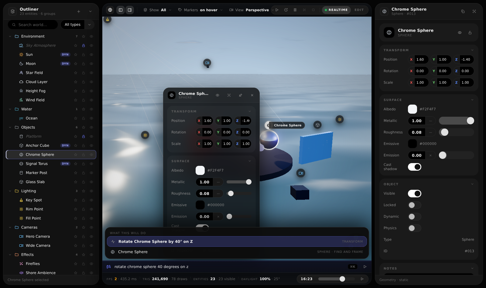

**The full reference is [`COMMANDS.md`](COMMANDS.md)** — every verb, how names and units are read,
what happens when it does not understand, and a list of the next verbs worth adding.

```
find chrome sphere                     locate it, select it, reveal it in the tree, frame it
rotate anchor cube 40 degrees on z     degrees by default; "1.57 rad on y" works too
move glass slab 2 m on x               or "move cube to x 4 y 1 z 0"
scale sphere 2x                        uniform, or "scale cube 2x on y"
add sphere at x 100, y 400, z 900      any type: cube, light, camera, particles, probe, audio…
add point light named Fire at x 1 y 2 z 3
enable physics on Cube001, sphere001   gravity, bounce and sleep — watch it under Simulate
enable physics on selected objects     "selection", "selected", "this", "them" all work
isolate selection                      and "exit isolation" to come back
set roughness of chrome sphere to 0.2  any property on any entity, by its own label
set colour of anchor cube to red       hex or colour words
set time to golden hour                or 17:40, 6pm, sunrise, midnight
hide star field · lock ocean · rename cube to Anchor Block · duplicate torus
delete marker post                     removes it from the scene
delete from ram marker post            deletes it AND disposes geometry, materials and textures
play · simulate · pause · step · stop · view top · frame everything · help
```

Names are matched forgivingly: `cub`, `Cube001` and `anchor` all find **Anchor Cube**, `all lights`
takes every light, and a bare name with no verb means *find it*. Word order barely matters —
`rotate 40 deg on z the cube` parses the same as `rotate cube 40 degrees on z`. If a phrase is
missing something, the console says which part rather than failing silently: *"How far should it
turn?"*

**Physics** is the one command that changes the world over time. A body accelerates under gravity,
lands on the platform (or the sea if it is off the edge), bounces once or twice and goes to sleep;
the footer counts how many bodies are awake. It only runs while the world is running, so the
authored scene never drifts — **Stop** puts every position back.

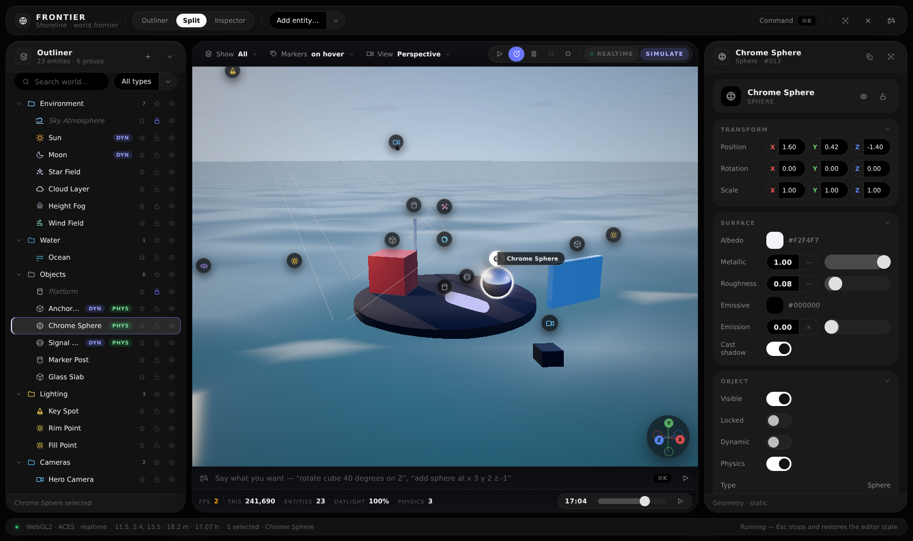

---

## The viewport chrome

```
┌ header ────────────────────────────────────────────────────────────────────────────┐
│ ◍ ▤ ▥ │ Show All ▾  Markers on hover ▾  View Perspective ▾    ★2 Exit  ▶ ⟳ ⏸ ⏭ ⏹ │ REALTIME │ EDIT │
├ view ──────────────────────────────────────────────────────────────────────────────┤
│                          billboards · gate mask · axis orb                          │
├ console ───────────────────────────────────────────────────────────────────────────┤
│ ⌨ rotate chrome sphere 40 degrees on z                                       ⌘K  ▷ │
├ footer ────────────────────────────────────────────────────────────────────────────┤
│ FPS 60 · 16.6 ms │ TRIS 241,690 · 78 draws │ ENTITIES 23 · 23 visible │ DAYLIGHT 100% · 46° │ CAMERA 11.5, 5.4, 13.5 · 18.2 m │ 09:12 ──o── ▶ │
└─────────────────────────────────────────────────────────────────────────────────────┘
```

**Panels.** The two buttons at the left of the header show and hide the outliner and the inspector
(<kbd>[</kbd> and <kbd>]</kbd>). Close both and the viewport is the whole window — the settings
popup, the console and the footer are enough to keep working, which is the point of them.

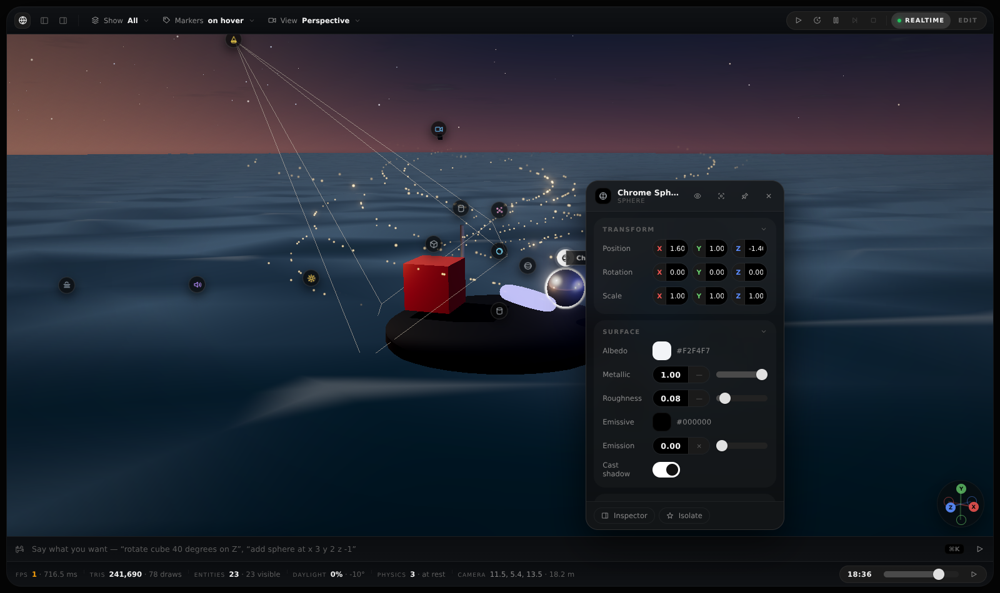

**Header.** Three menus and one strip. *Show* is a checklist of categories with a live count each,
plus All / None, and it stays open while you tick things off. *Markers* picks how billboards read.
*View* holds the six standard views and the two framing commands — and the label stops claiming
`Top` the moment the camera no longer looks down that axis, whichever way you moved it. The isolate
chip appears beside the transport only while an isolation set exists.

**Footer.** Counters that tell the truth: frames per second and the milliseconds behind them,
triangles and draw calls accumulated across *every* pass of the composer, entities in the world and
how many survive the current visibility and isolation state, daylight and sun elevation, physics
bodies and how many are awake, the isolated count when there is one, and where the camera is. The
time-of-day scrubber sits on the right where a timeline belongs. When the bar runs short it sheds
the camera cell first and the secondary halves second — it never clips.

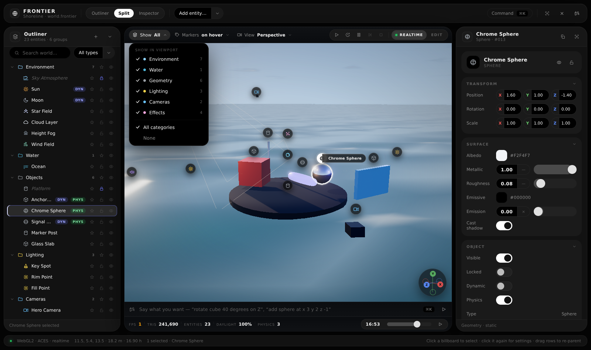

---

## Transport

| Control | What it does |
| --- | --- |
| **Play** <kbd>Alt P</kbd> | Looks through the selected camera (or the first one), masks the frame to its gate, hides billboards, gizmos, selection outlines and viewport furniture, and tags the frame with lens and aperture. |
| **Simulate** <kbd>Alt S</kbd> | Runs the same clock with the editor camera unlocked, so you can fly around a world that is moving. |
| **Pause** <kbd>P</kbd> | Freezes the clock. Everything stays interactive; nothing advances. |
| **Step** <kbd>.</kbd> | Advances exactly one frame (1/30 s) while paused. |
| **Stop** <kbd>Esc</kbd> | Ends the run and **restores the snapshot** taken when it started — every property, name, visibility and lock, the time of day, and anything spawned mid-run is discarded. |
| **Realtime** <kbd>Ctrl R</kbd> | Editor-only toggle. Off, the viewport animates nothing and redraws only when something changes — the same idea as Unreal's realtime viewport switch. It is forced on during a run. |

The state chip on the right of the pill always names the truth: `Edit`, `Edit · static`,
`Simulate`, `Play`, `Paused`.


---

## Isolation

Isolation is a **set**, not a solo slot. Select any number of entities and press <kbd>I</kbd>, or
click the star on any row, or use the popup's *Isolate* button — each one adds to or leaves the
set. Isolating a folder keeps its whole subtree. Everything outside the set stops rendering and its
billboard goes with it, the rows dim in the tree, and an amber banner over the viewport counts what
is isolated and offers the way out (<kbd>Esc</kbd> also exits).


Watch the footer while you do it: `ENTITIES 23 · 3 visible`, `TRIS` collapsing from 241,690 to
11,913, and an `ISOLATED 3` counter that only exists while the set does.

---

## Entities

| Group           | Entities                                                                        |
| --------------- | ------------------------------------------------------------------------------- |
| **Environment** | Sky Atmosphere · Sun · Moon · Star Field · Cloud Layer · Height Fog · Wind Field |
| **Water**       | Ocean (Gerstner surface, sun glint, foam, fog integration)                       |
| **Geometry**    | Cube · Sphere · Torus · Cylinder · Plane                                          |
| **Lighting**    | Point Light · Spot Light                                                          |
| **Cameras**     | Camera proxies with lens, framing gate and frustum gizmo                          |
| **Effects**     | Particles · Reflection Probe · Audio Emitter · Post Stack                         |

Every one of them is *live*: the sun's elevation moves the shadows and repaints the sky, the moon's
phase is analytic, star brightness follows dusk, wind drives both the cloud deck and the swell,
the fog node owns `scene.fog`, and the post stack owns tone mapping, bloom, vignette and grain.
Metals reflect the real sky through a PMREM cube that is regenerated whenever the environment
changes (debounced, never per frame).


---

## Keyboard

| Key | Action | | Key | Action |
| --- | --- | --- | --- | --- |
| <kbd>⌘K</kbd> | jump to the console | | <kbd>F</kbd> | frame selection |
| <kbd>Tab</kbd> | accept the ghosted completion | | <kbd>↑ ↓</kbd> | (in the console) history / rows |
| <kbd>[</kbd> | outliner panel | | <kbd>]</kbd> | inspector panel |
| <kbd>Enter</kbd> | toggle settings popup | | <kbd>Shift F</kbd> | frame the world |
| <kbd>H</kbd> | hide / show | | <kbd>L</kbd> | lock |
| <kbd>I</kbd> | isolate selection | | <kbd>⌘D</kbd> | duplicate |
| <kbd>↑ ↓</kbd> | walk the tree | | <kbd>← →</kbd> | collapse / expand |
| <kbd>⌫</kbd> | delete | | <kbd>Esc</kbd> | stop the run → exit isolation → close popups |
| <kbd>Alt P</kbd> | play | | <kbd>Alt S</kbd> | simulate |
| <kbd>P</kbd> | pause / resume | | <kbd>.</kbd> | step one frame |
| <kbd>Ctrl R</kbd> | realtime viewport | | | |

Double-click a row (or a popup title) to rename. Right-click anything for its context menu.

---

## Architecture

```
index.html          shell: outliner dock · stage · inspector dock — nothing else
                    stage = header (panels + menus + transport) · render view · console · footer
src/
  world.js          entity table + property SCHEMA + the authored scene (single source of truth)
  viewport.js       three.js scene: sky/moon shader, star dome, cloud deck, ocean, gizmos, post
  billboards.js     DOM markers projected from world-space anchors, depth sort + declutter
  outliner.js       tree: search, filters, twirl animation, multi-select, drag-to-reparent
  inspector.js      builds a property sheet for any node straight from its schema
  panels/           bespoke instruments that replace the generated sheet for a few types
    index.js        the registry: which type gets an instrument, which groups it claims
    controls.js     tapes, steppers, state pills, spec tiles — the no-slider control kit
    moon.js         night sky, phase strip, selenographic atlas, sky track, light meter
    sun.js          sky strip, stereographic sun path, illuminance curve, blackbody ramp, shadows
    water.js        a section through the sea: wave pad, Douglas scale, depth ramp, glitter
    wind.js         a live flow field, anemometer trace, Beaufort scale, and what obeys it
    sky.js          a slice of the real sky, extinction spectrum, Mie phase curve, visibility
    stars.js        a live star field, magnitude histogram, spectral ramp, sidereal drift
    fog.js          calibrated sight line, contrast curve, vertical profile, scattering chamber
    folder.js       hierarchy map, collection composition, live manifest, branch controls
    geometry.js     turntable, world placement deck, dimensions, interactive BRDF laboratory
  popup.js          floating, tethered, pinnable settings panels (same sheet, compact)
  lang.js           plain-English command parser: verbs, fuzzy entity lookup, suggestions
  kit.js            ControlKit primitives: slider, switch, value pill, axis field, dropdown, colour
  icons.js          one stroke language, 24×24
  bus.js            select / propchange / treechange
  styles.css        design tokens — the only place a colour or radius is written down
```

**Why the UI never hard-codes a control.** `world.js` describes each entity type as groups of
property definitions (`slider`, `switch`, `vec3`, `color`, `select`, `readout`). The inspector, the
popup, the command palette and the outliner filters all read that table, so adding an entity type —
or a property to an existing one — is a few lines of data, no UI work. That is also what makes the
sheet portable: the same table can drive the engine-side `ControlKit` panels one-for-one.

**Why a few types get an instrument instead of a sheet.** A moon is a thing you look at and a sun is
a thing you aim, so those two are drawn rather than listed: `panels/index.js` maps a type to
`{ build, owns }`, the instrument claims the schema groups it replaces, and anything it does not
claim is still generated underneath it — no property is ever unreachable. Inside an instrument there
are no sliders: values live on **tapes** (a ruler with the range written on it and a marker you can
grab) with a **stepper** beside them for the last decimal, and every visualisation is also the
control — drag the sun path to move the clock, the lux meter to change the moonlight, the degree
ruler to resize the disc.

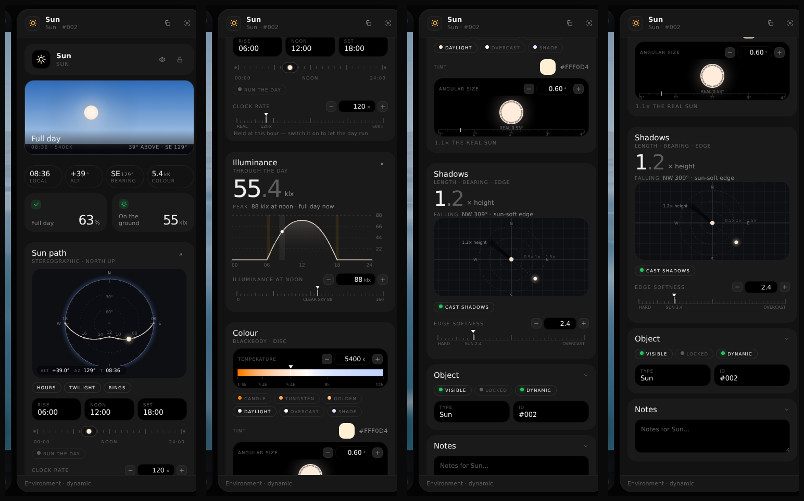

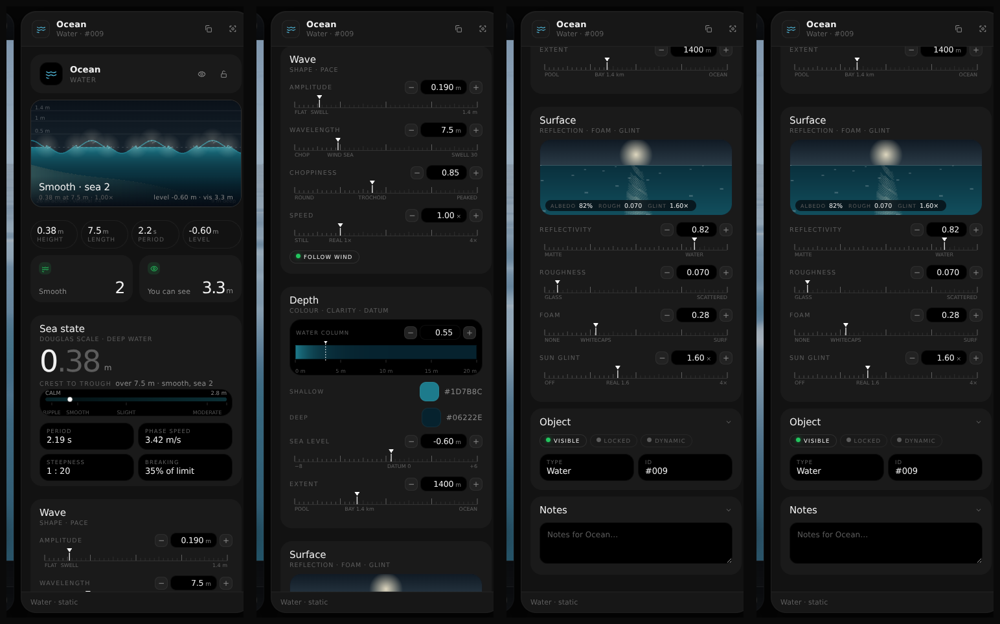

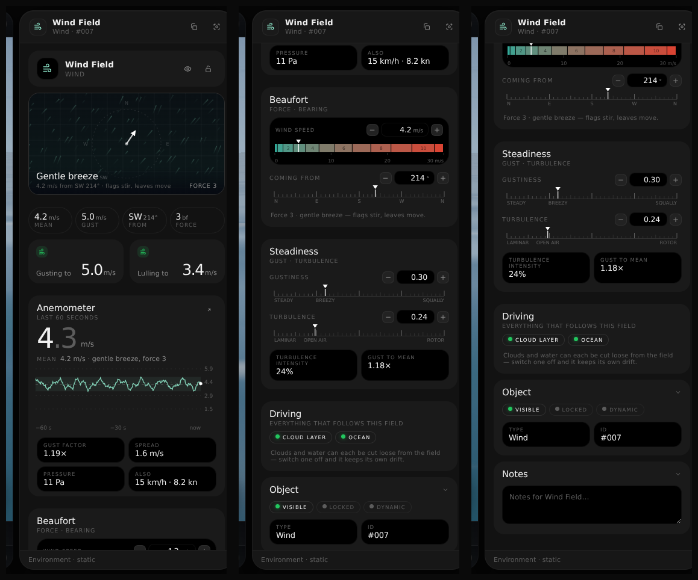


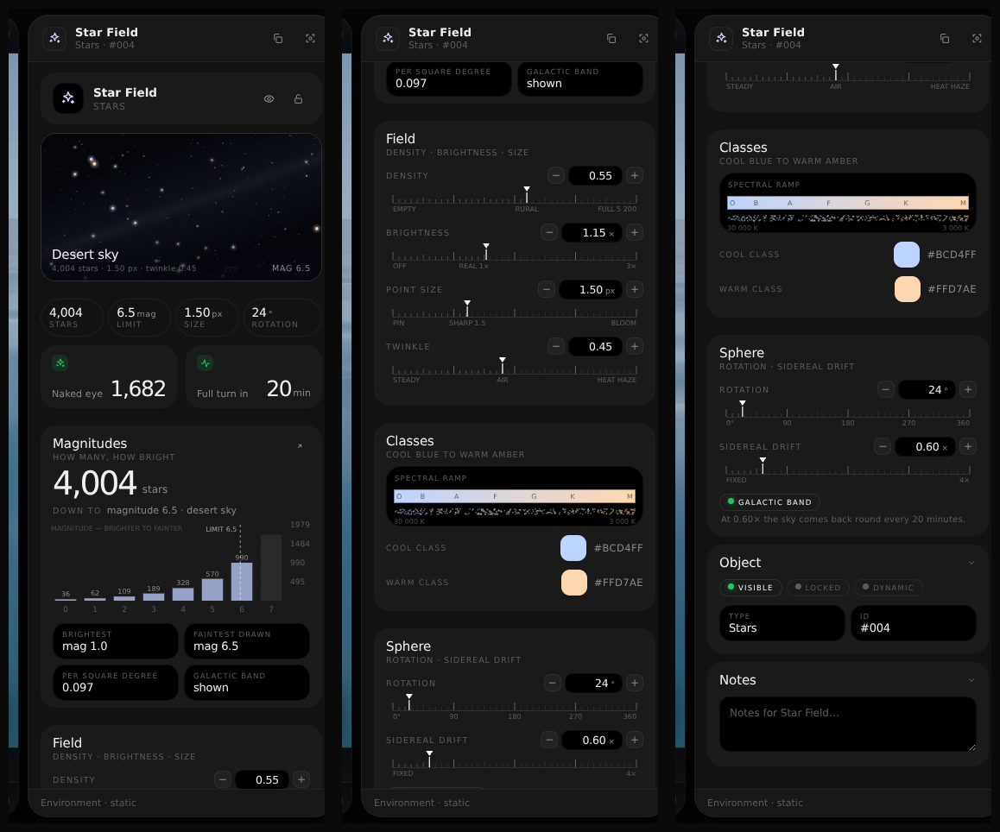

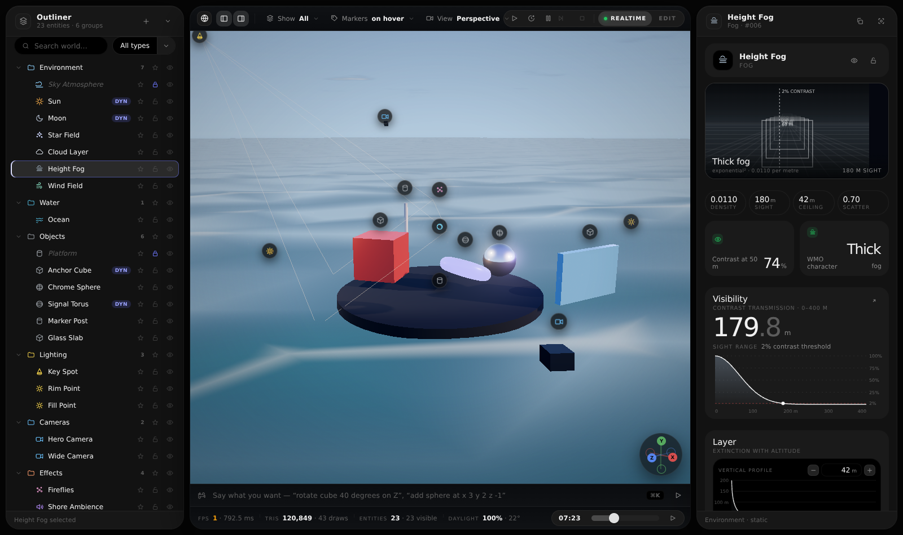

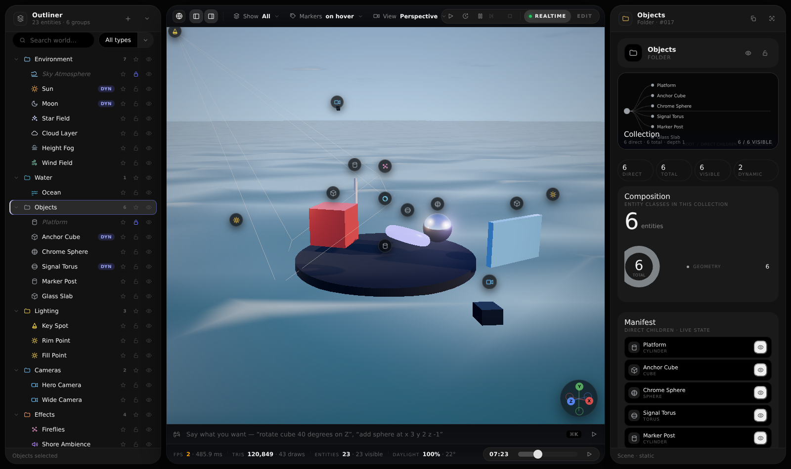

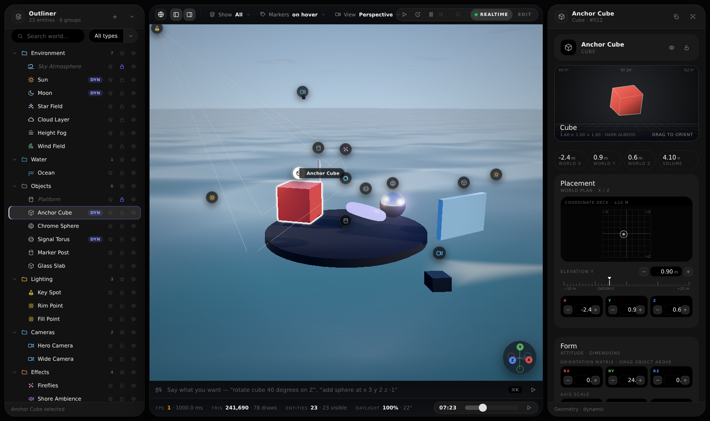

**Why DOM billboards instead of sprites.** Glyphs stay crisp at any distance, labels stay legible,
hit-testing is exact and free, hover/selected states are CSS, and a popup can be tethered to a
marker without a second projection path. The 3D scene keeps the pixels; the UI keeps the widgets.

### Tokens

`src/styles.css` is the Slate token block verbatim — surfaces `#050505 / #121212 / #1a1a1a / #000`,
strokes, `--hi: #6c77ff`, radii `24 / 18 / 999`, `--ease: cubic-bezier(.22,.61,.36,1)`. Sliders use
ControlKit geometry (the fill is a pill that ends under the thumb centre, never a hard-edged
gradient stop) and every numeric readout is type-in editable, clamped to its own range.

### Notes

* No terrain — deliberately. The world is sky, water, light and objects.
* No application bar and no status bar. Everything they held moved to where it is used: the panel
  toggles and the brand to the viewport header, **Add entity** to the outliner header (that `+` used
  to expand the tree, which is what the twirl next to it is for), the command entry to the console,
  the renderer and camera readouts to the footer, and the selection line to the outliner footer.
* Selecting anything opens its settings popup by default — independent of the inspector dock, which
  may not even be on screen in outliner-only layout. The popup follows the selection and is replaced
  by the next one unless you claim it by pinning or dragging it. Turn the behaviour off in the
  **Markers** menu, or say `auto popups off`.
* `window.frontier` exposes `{ state, app, setTimeOfDay, vp, popups, outliner, billboards, world,
  setTransport, setPaused, setRealtime, stepFrame, snapView, lang, run }` for console poking and
  automation — `frontier.run('rotate cube 40 deg on z')` executes a line exactly as if typed.
* The viewport owns one clock. `vp.setClock({ animate, render })` is the only switch that decides
  whether the world moves and whether a frame is drawn; everything else — the transport, the day
  cycle, the realtime toggle — is a caller of it.
