# 東亜 Building Generator — procedural East-Asian architecture

A **procedural building generator for East Asian (Japanese / Chinese / Korean) architecture with a modern layer on top** — the browser equivalent of a Blender geometry-node rig: every building is driven entirely by parameters, and every parameter is a live control you can toggle while the model regenerates.

Ancient forms (irimoya roofs, flying eaves, kawara tiles, lattice screens, noren, lanterns, torii) fused with modern city furniture (AC units, neon signage, vending machines, downpipes, rooftop water tanks, utility poles and sagging power lines).

| | |
|---|---|
| 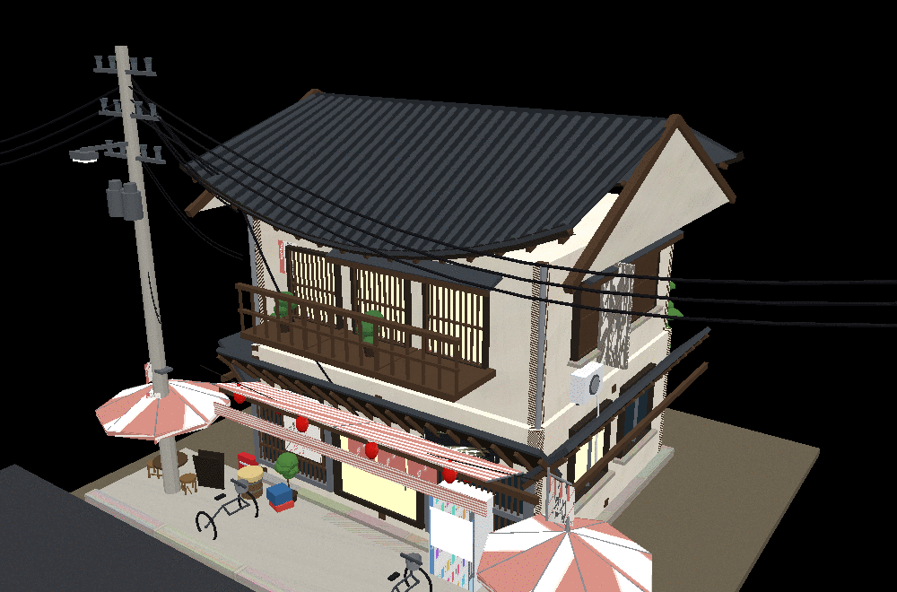 **Machiya** — Kyoto townhouse, irimoya roof | 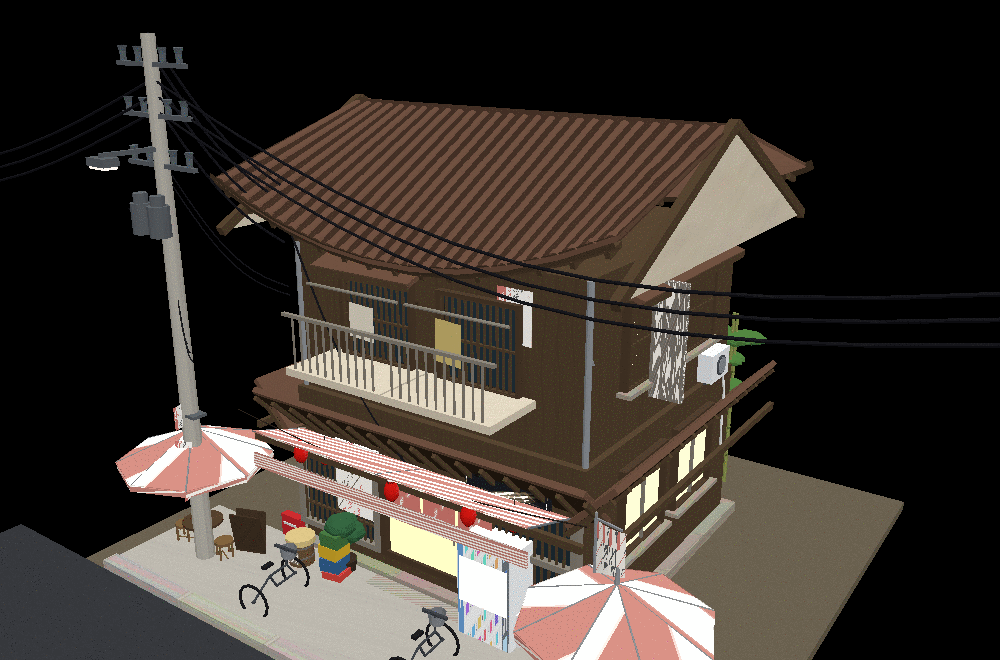 **Ramen bar** — noren, lanterns, awning |
| 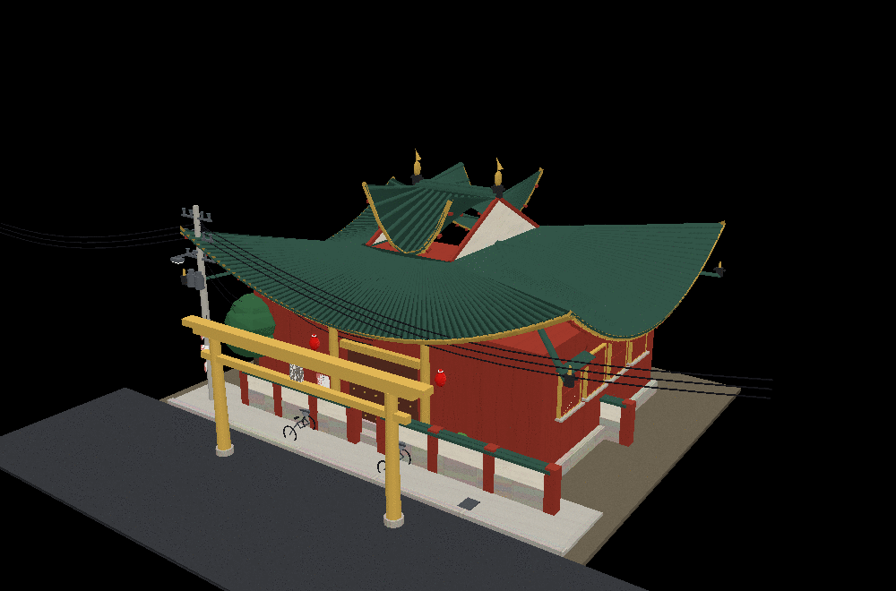 **Temple** — vermilion timber, torii, shachihoko | 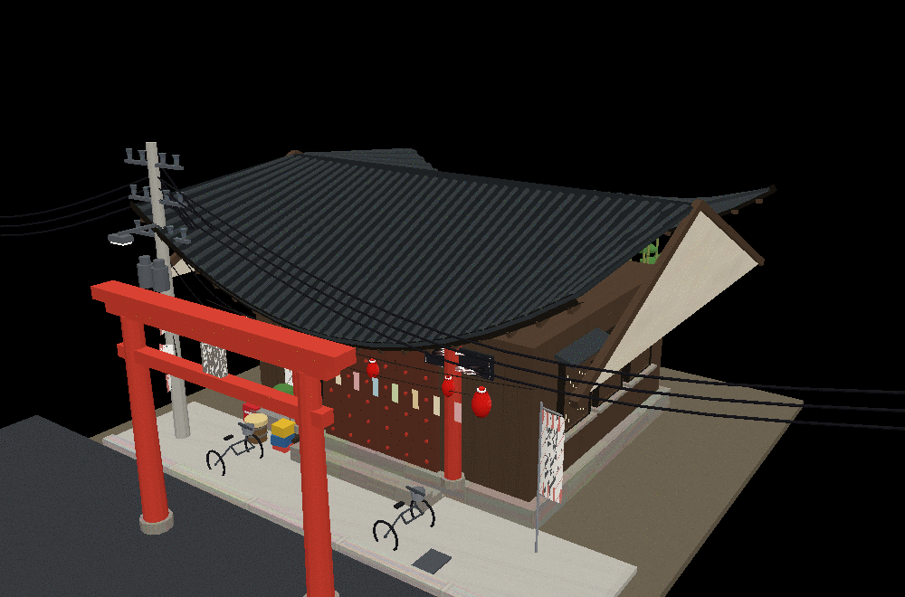 **Shrine** — gable roof, wish slips |
| 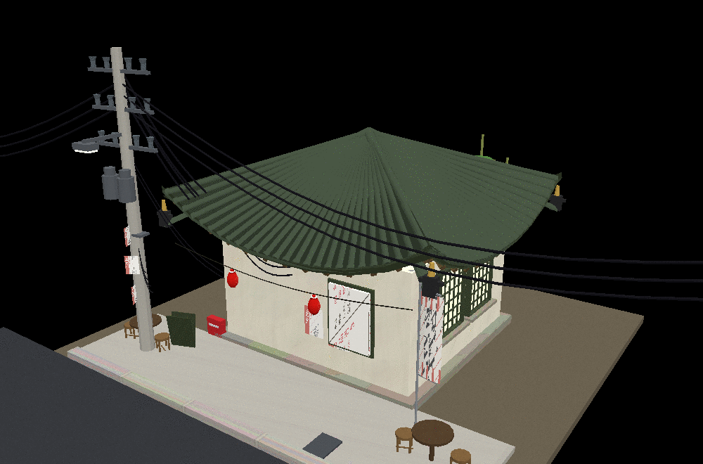 **Teahouse** — pyramidal roof | 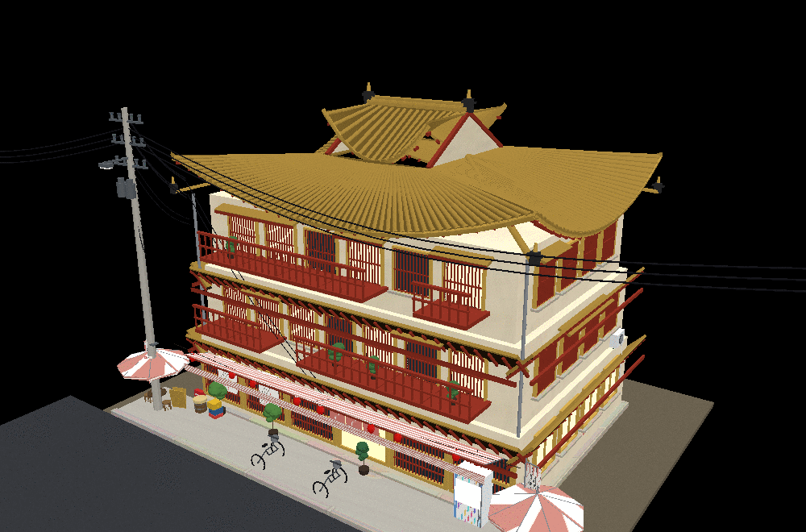 **Ryokan** — 3 storeys, irimoya |
| 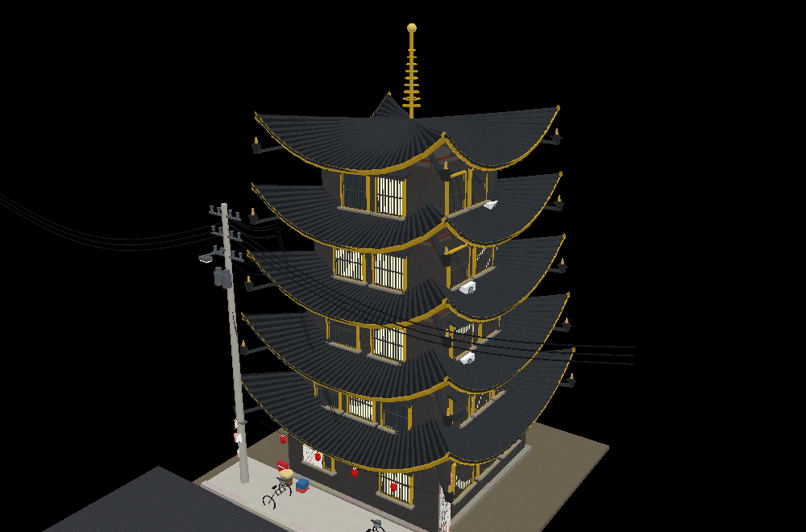 **Pagoda** — every tier roofed + sōrin spire | 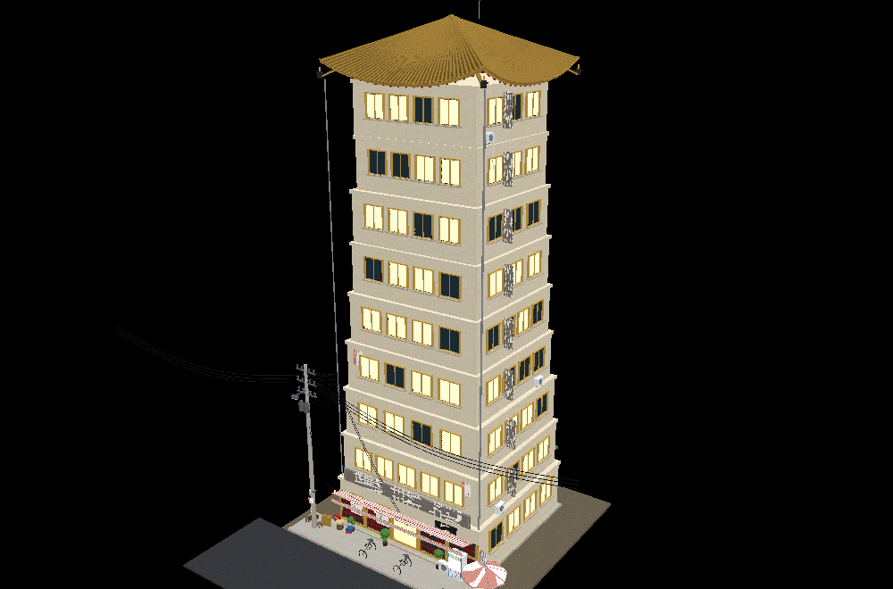 **Tower** — modern hi-rise, ancient crown |
| 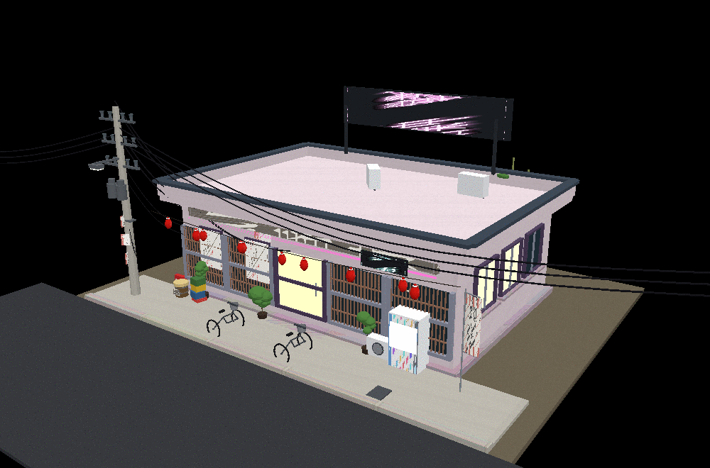 **Konbini** — flat roof, neon | 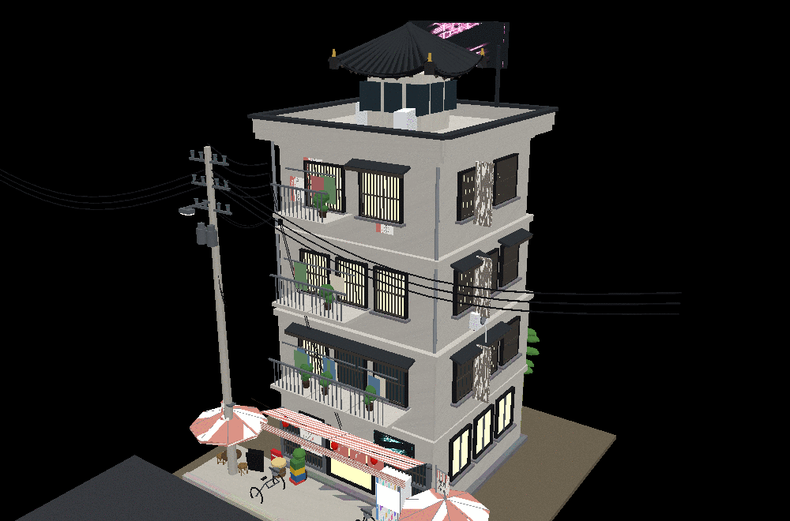 **Arcade** — modern district |
| 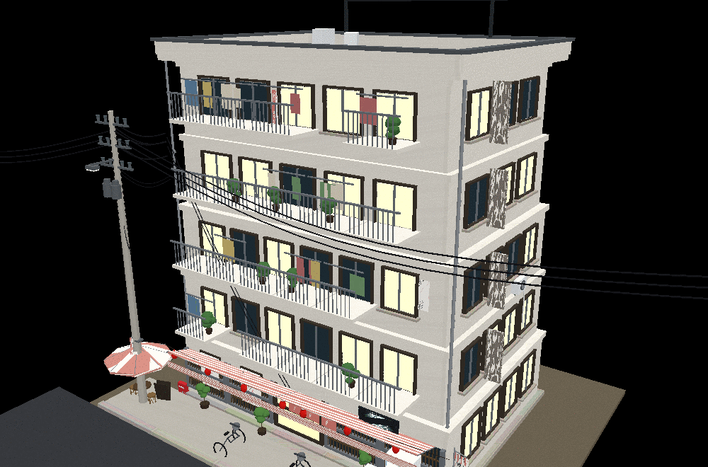 **Apartment** — balconies, laundry | 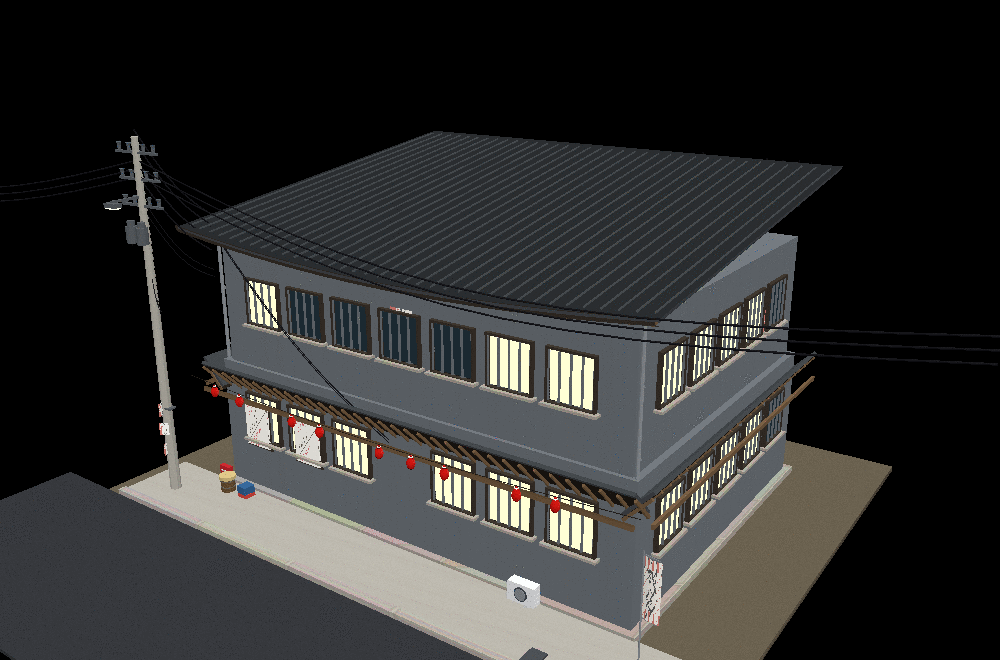 **Factory** — shed roof, metal walls |

A whole street, generated from one click (`Street generator` → toggle, then click any building to edit it):

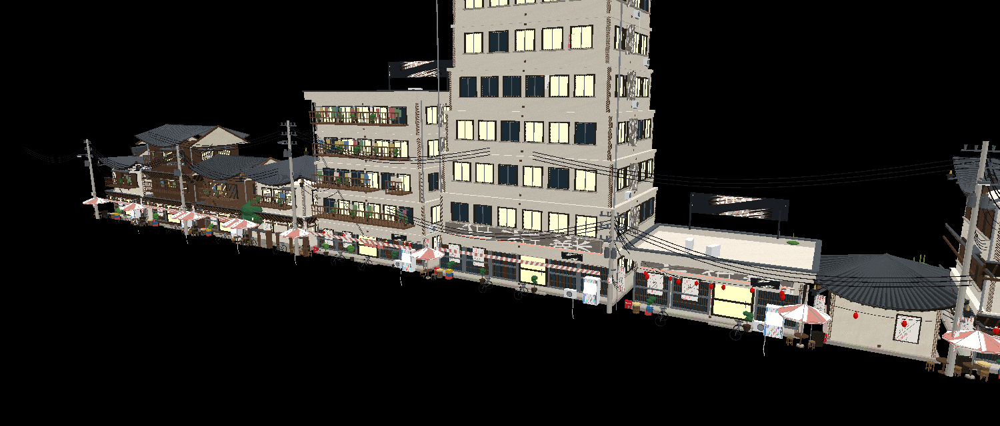

---

## Quick start

```bash
npm install
npm run dev          # → http://localhost:5173
```

Build a production bundle with `npm run build`, serve it with `npm run preview`.

The app is a single-page tool:

- **Left:** live 3D viewport (orbit / pan / zoom, post-processing bloom, day-night presets `1`–`5`).
- **Right:** the parameter panel — every knob rebuilds the model immediately.
- **Top bar:** `🎲 Randomize` (new building + style), `Generate`, `⬇ .glb`, `📷` snapshot, `Lights: on/off`.

Keyboard: `R` randomize · `G` export GLB · `F` frame · `H` toggle lights · `1…5` time of day.

---

## What it generates

### Buildings (15 types)
`machiya · shop · ramen · house · apartment · office · temple · shrine · teahouse · pagoda · ryokan · factory · konbini · arcade · tower`

Each type ships with its own preset (footprint, floor count, roof form, shopfront, props, modern-mix bias) which you can then override piece by piece.

### Roof forms & tiles
| Roof form | Japanese | Notes |
|---|---|---|
| `gable` | 切妻 kirizuma | ridge, bargeboards, decorated gable ends |
| `hip` | 寄棟 yosemune | four slopes, hip ridges, corner ornaments |
| `irimoya` | 入母屋 | hip-and-gable: lower hip skirt + upper gable |
| `pyramid` | 宝形 hōgyō | converging apex, pagoda pavilions |
| `tiered` | 五重塔 | true multi-storey pagoda: every tier carries its own roof + sōrin spire |
| `shed` | 片流れ | factories, lean-tos |
| `flat` | 陸屋根 | parapet with a tiled cap + optional rooftop pavilion |

Tile types: `kawara · ridge-round · flat-clay · slate · metal-rib · shingle · thatch` — each changes rib spacing/profile, eave caps, courses and ridge weight.

The roof surface itself is a parametric sampler, so the *flying eaves* (`sori`) sweep, the tile ribs, the eave fascia, the rafters and the ridge caps all follow the exact same curvature. `roofCurve` 0→1 goes from a straight modern roof to a strongly lifted, concave temple roof.

### Structure & façade
- Floating floors: 1 – 12 storeys, per-floor footprint drift controlled by **Irregularity**.
- Walls: plaster, timber, stone, concrete, tile, metal, brick · wood species: hinoki, cedar, walnut, ebony, weathered, bamboo, boards.
- Openings: modern glazing, timber lattice (格子), paper shōji, industrial mullions — with sills, frames, recesses and small skirt roofs (庇).
- Balconies/verandas with timber or steel rails, laundry poles and hanging cloth, potted plants.
- Skirt roofs between floors, shopfronts with glass bays, doors, entry steps, roller shutters, awnings, noren curtains and interior slices (izakaya counter, café tables, konbini shelving) visible through the glass.

### Modern layer (`modernMix` slider)
AC units with drip pipes, downpipes and gutters, rooftop water tanks, solar panels, TV antennas and dishes, rooftop railings, neon signage (shopfront + rooftop frames), vending machines, parked bicycles, crates/barrels/gas cylinders, post boxes, fire-hose boxes, street tables, stools, benches and parasols.

### Power & telecom
Utility pole with crossarms and insulators, transformers, service loops, street lamp, power lines, telephone/fibre lines, plus wires running off to both sides of the frame. All wires are true catenary sag curves.

### Lighting
Lantern rigs (chōchin on posts and strung across the façade), stone lanterns (tōrō), warm shōji glow, window glow (randomised per window), neon tubes, street lamp, interior ceiling lights, vending-machine light boxes. Choose `warm · cool · neon · mixed`, set intensity, and toggle real runtime point lights (`Real lights`) or bloom.

### Signage, posters & text — **your own words**
Every text element is editable; blank fields get invented automatically (from a built-in pool of kanji shop names, board copy and poster lines). The generated canvas textures are baked into the materials, so your text survives the GLB export.

- Main sign band + sub-line · vertical side signs · hanging vertical signs
- Neon text · noren curtain text · nobori banner text · lantern text
- A-board headline and body lines · poster title + multi-line body (one line per row)
- Menu board title (items are generated from a menu pool)

### Street mode
Toggle **Street generator** to lay out a whole block: 2 – 14 buildings, each generated by the same graph with its own seed, with per-building type/floor/footprint/colour drift. Click any building in the viewport to pull *its* settings back into the panel. Street characters: mixed neighbourhood, old town, commercial strip, temple precinct, modern city.

### Style themes (10 palettes)
`machiya · edo · temple · lacquer · showa · citypop · neonDistrict · whitewash · bamboo · imperial`

Colours can always be overridden per-part (wall, wood, trim, roof) with the colour pickers — `auto` restores the theme's colour.

---

## Determinism

Every building is generated from a **seed** string. Same seed + same settings = byte-identical geometry, which makes variants, diffs and Blender round-trips reproducible. Uncheck/retype the seed to branch. Whole parameter sets save to `.json` and reload.

---

## Export to Blender

`⬇ .glb` writes a binary glTF of the current building (or the entire street row): merged geometry per material, procedural canvas textures baked in, metres as units.

In Blender: **File → Import → glTF 2.0**. You get one object per material (roof, walls, timber, glass, signs…), so you can keep pushing it around with your own modifiers.

---

## Architecture

```
src/
  main.js            app wiring: panel schema, actions, export, street mode
  viewer.js          renderer, OrbitControls, day-night rig, bloom, shadow fitting
  ui.js              schema-driven control panel (toggles, sliders, chips, text)
  styles.css
  data/names.js      palettes, shop-name pools, poster/menu copy
  lib/
    prng.js          seeded RNG (mulberry32 + hashing) — the determinism backbone
    textures.js      procedural canvas textures (wood, plaster, stone, signage, neon…)
    materials.js     material factory + cache (shared across a whole street)
    geom.js          geometry helpers, grids, sweeps, sag curves, merging
    builder.js       transform stacks + per-material geometry accumulation
    roofs.js         parametric roof surfaces, tiles, ridges, ornaments, pagodas
    props.js         street furniture library (lanterns, poles, vending, bicycles…)
    building.js      the generator: massing → façade → roofs → props → signage
```

Each `build*` routine appends geometry into the `Builder`, which merges everything into one mesh per material — a typical building is a few dozen draw calls / glTF primitives and 15k–70k triangles instead of thousands of objects.

---

## Verification

There is no GPU or browser inside the development sandbox, so the project ships with its own headless verification rig:

```bash
npm test          # full generator sweep: types × roofs × tiles × themes × edge cases
npm run shots machiya machiya s1   # auto-framed PNG renders of one building
npm run textures  # dumps every procedural texture to shots/tex/
```

`npm test` covers all 15 building types, 7 roof forms × 7 tile types (49 combinations), every theme, every detail level, determinism, NaN/geometry sanity and extreme parameter sets, then writes software-rendered previews (`scripts/render.mjs` is a small z-buffered, perspective-correct, textured rasteriser over the three.js scene graph) — that is how the preview images in `shots/` were produced.

Browser-level test (optional, needs a local Chrome): `npm i -D puppeteer && npx puppeteer browsers install chrome && npm run test:browser`.

---

## Notes & limits

- Signs are drawn with the Canvas 2D API at generation time; the app will fetch Noto Sans JP / Shippori Mincho (~2.4 MB total, code-split and lazy) only when your system cannot render kanji itself, and re-bake the textures when they arrive.
- Real point lights are capped (12 per scene) for performance — emissive materials carry the look regardless.
- Exporting a 14-building street produces a large GLB (all textures baked); lower **Detail level** first if you need something lighter.
