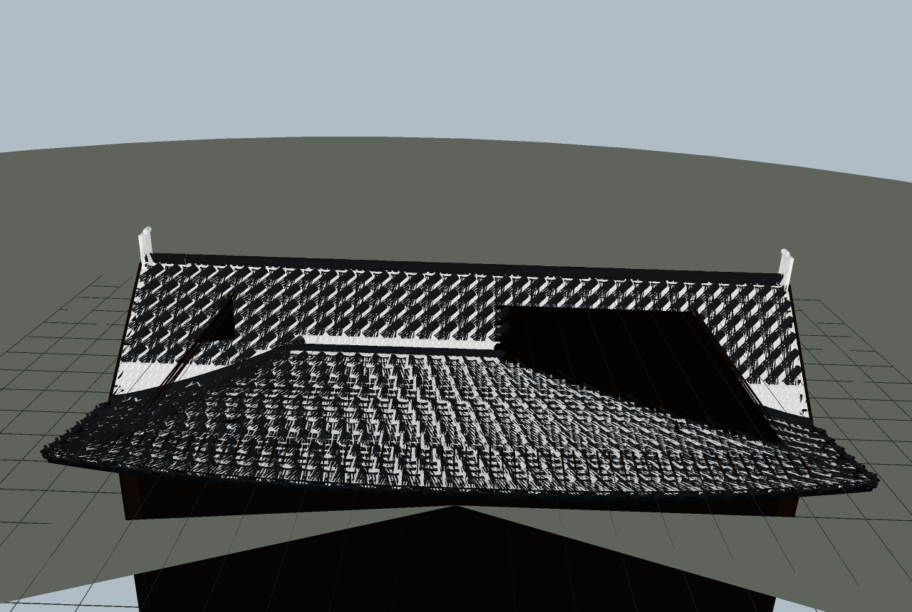

# Frontier — Japanese / East Asian Roof Generator (v1: roofs)

Procedural, parametric generator for traditional Japanese roof forms with
**historically-correct structure and tiling**, built with three.js.
Runs in the browser, exports GLB for Blender/Unity/Unreal.



## Run

```bash
npm start          # → http://localhost:8000
```

## The four canonical roof forms (verified)

| Form | Kanji | Geometry |
|---|---|---|
| **Kirizuma** | 切妻 | Open gable — two sloped planes, barge boards (hafu-ita), exposed gable frame |
| **Yosemune** | 寄棟 | Hipped — ridge + two trapezoid + two triangular faces, hips run to the corners |
| **Irimoya** | 入母屋 | Hip-and-gable — lower hipped skirt, steeper upper gable, descending ridge (kudari-mune) along the computed junction curve |
| **Hōgyō** | 宝形 | Pyramidal — four triangular faces to a central finial (gates, pavilions) |

### How correctness is enforced (research-based)

- **All four forms come from one height-field** `z = f(max(|y|, (|x|−cxr)/ax))` whose
  level sets are the rectangles tile courses follow — so courses, hips and ridges are
  mathematically consistent, no floating or intersecting shells.
- **The roof bears on the wall plate** (keta / noki-geta): deck z = plate top + rafter
  depth + sheathing at the wall face, checked automatically (`npm run check` asserts
  the seating to ±5 mm). Overhangs cantilever *beyond* the bearing line, like taruki
  rafters on a real building.
- **Hongawara-buki tiling laid the traditional way**: courses of concave pan tiles
  (hiragawara) running parallel to the eave, semi-cylindrical cover tiles
  (marugawara) capping every joint and running up the slope, decorated eave-end
  tiles (gatō) at the bottom edge, half-round ridge caps (noshigawara) with plaster
  fillet (shironuri) capping ridge and hips, onigawara (with toribusuma) closing
  ridge ends.
- **Slope profile**: steep at the ridge (33°), shallower at the eave (21°), with the
  subtle upward kick at the edge (nokiage) and corner lift (sumi-sori) of East Asian
  roofs.
- **Continuity is machine-verified**: `tools/render.mjs` is a software rasterizer +
  ray-tracer over the exact generated triangles. It checks (a) no NaN/huge
  coordinates, (b) nothing below ground, (c) zero holes via vertical raycasts with
  the deck hidden, (d) seating, in all four forms.

### Shrine fittings (optional)

- **Chigi** 刢 — crossed battens standing on the ridge ends
- **Katsuogi** 堅魚木 — short logs laid across the ridge in symmetric pairs
- **Onigawara** 鬼瓦 — canvas-textured ridge-end tiles with demon face, scale control

## Parameters (geometry-nodes style panel)

Form · length/depth/wall height · eave & rake overhang · ridge/eave pitch ·
eave kick · corner lift & falloff · (irimoya) hip-ridge height & gable break ·
tile pitch / cover width / course exposure / hand-laid jitter · ridge cap size ·
plaster fillet · onigawara + scale · chigi + katsuogi count · exposed rafters ·
gable frame · tile / wood / wall / plaster / fascia colours · seed.

Presets: 農家 minka farmhouse · 町家 machiya shop · 寺院 temple hall · 神社 shrine · 門 hōgyō gate.

## Export

**Export GLB** button → imports into Blender (File ▸ Import ▸ glTF), Unity, Unreal,
or any glTF viewer. Geometry is one merged flat-shaded vertex-coloured mesh
(~75k tris at default size) plus the textured onigawara slabs.

## Verification tooling

```bash
npm run check    # build all 4 forms headlessly, assert seating / bounds / NaN
npm run shots    # render verification views to shots/ (software rasterizer)
```

Debug env flags for `npm run shots`: `DEBUG_COLOR=1` (per-mesh colours),
`DEBUG_HIDE=deck` (hide deck to expose any tiling holes), view set:
`iso front gable eave ridge high top end ridge34`.

## Roadmap (next phases)

- Buildings: store / house / office / temple massing, multi-storey (booleans),
  engawa verandas, shoji/amado openings, ranma transoms
- Props: chōchin lanterns, stone lanterns, benches, vending machines (modern blend)
- Signage: editable kanji posters / noren / shop boards (canvas textures)
- Utilities: power poles, telephone wires, rooftop antennas — per-building toggles
- Tile styles: sangawara (modern S-tile), glazed colours; thatch and bark roofs
- Chinese/Korean plan variants (xieshan, wudian, paljak)

## Layout

```
index.html         app shell + parameter panel UI
server.js          zero-dependency static server (npm start)
src/core.js        profile curve, height-fields (all 4 forms), geometry buffer
src/tiles.js       hongawara tiling (pan + cover courses, eave tiles)
src/parts.js       ridge caps, onigawara, chigi/katsuogi, walls, rafters, fascia
src/build.js       assembles a complete roof from parameters
src/main.js        scene, lights, panel, presets, GLB export
tools/check.mjs    headless structural assertions
tools/render.mjs   software rasterizer / ray-tracer for verification
```
